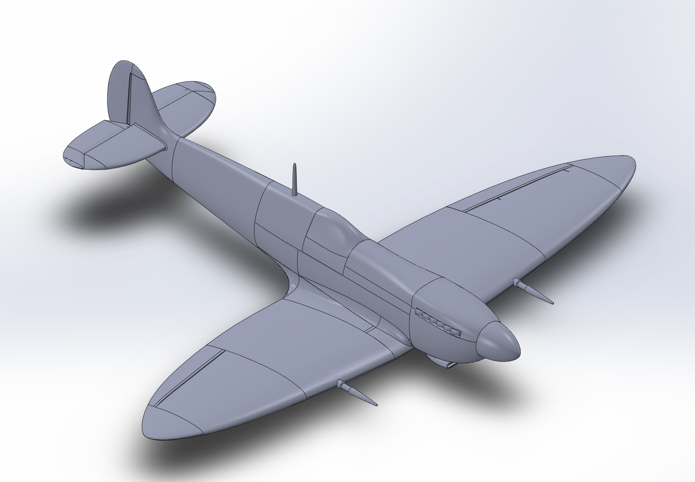
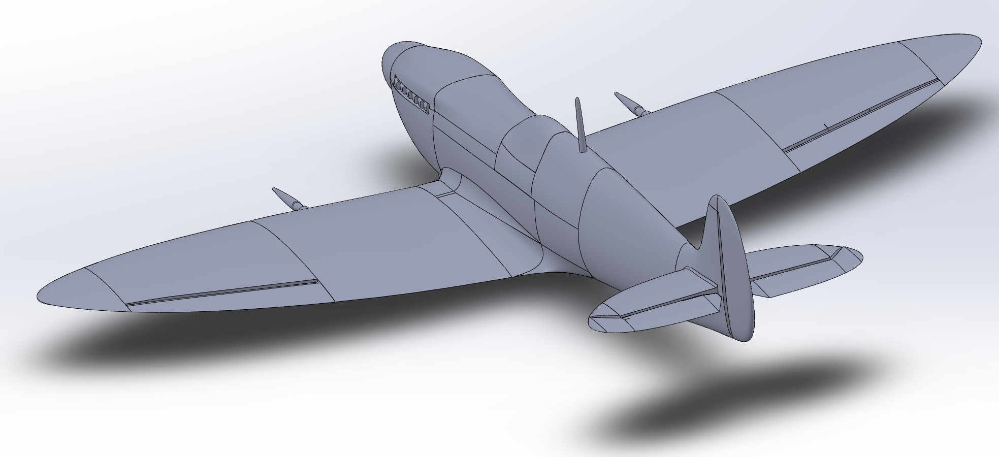
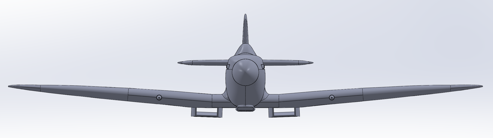
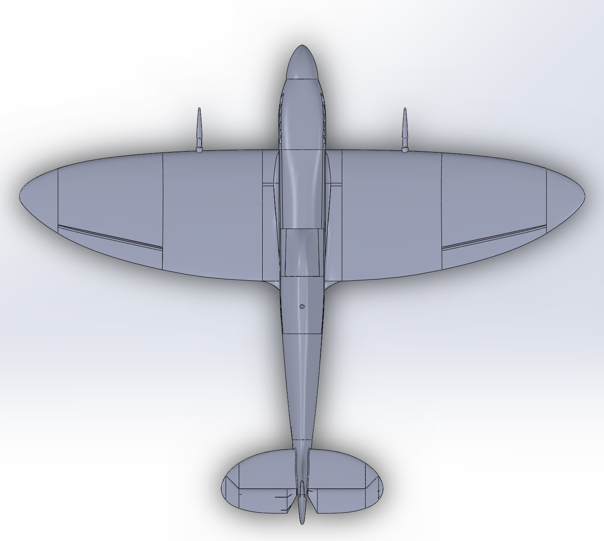
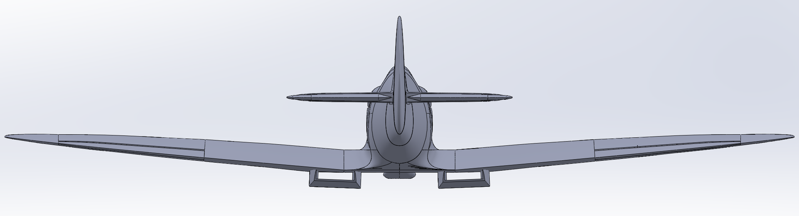
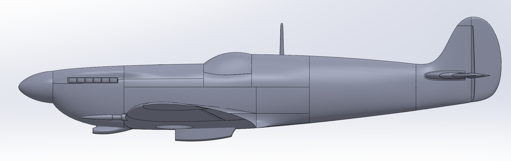

# Warbird

Warbird is an ongoing project involving the design, fabrication, and testing of a flight-capable remote controlled aircraft. Modelled after the Supermarine Spitfire Mk. IX, the plane will consist of numerous 3D printed sections based on custom-made CAD models developed in Solidworks. This repository contains different CAD models that make up the plane's airframe and control surfaces.

## Airframe and Control Surfaces

The 3D model for the RC plane has been developed using 2D orthographic blueprints of the Spitfire which were available online. The entire airframe, including fuselage and wings, will be 3D printed out of ABS plastic in multiple sections. This modular design allows for simplified maintenance through the use of smaller, easily-replaceable parts. Additionally, this strategy encourages space-efficient manufacturability on a print bed as multiple sections can be printed at once.

The control surfaces of the plane (elevators, ailerons, and rudder) will also be 3D printed components. These mechanisms are to be controlled using linkages driven by mounted servo motors in order to manipulate the aircraft's pitch, roll, and yaw during flight.

## Electronics

Considering the extra challenge of having an airframe made of ABS, the plane will be powered with a LiPo battery in order to minimize weight. The battery will power a DC brushless motor to drive the plane's propeller for thrust, as well as the servo motors for the plane's control surfaces. On board the plane will be a radio receiver to which a remote controller can send instructions to control the plane's systems in flight.

## Testing

Upon completion of all 3D models, the finished assembly shall be tested in a Computational Fluid Dynamics simulation to explore the behaviour of air as it flows around the airframe. Tweaks to the model may be required to improve laminar flow over the airfoil if necessary to generate stable lift. The electronics systems has, and will continue to be, bench tested before being installed into the airframe. This will be done to ensure that all systems work nominally before moving to flight. Once integrated into the assembled airframe, the motor and control surfaces will be tested again to ensure proper functionality. After these tests have been conducted, the plane will be ready for its first test flight.

# Model

## Isometric Views

## Front View

## Top View

## Rear View

## Side View
